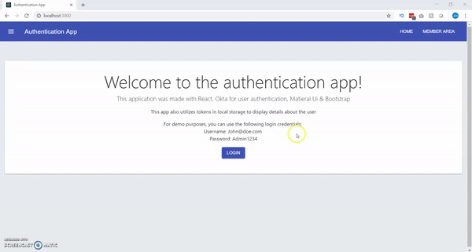

# ReactAuthenticationApp
This application keeps users out of a secure page until they sign in. The application was created with React, Bootstrap & Material-Ui, and I used Okta (https://developer.okta.com/) to manage user authorization. 

# Demo 

The demo demonstrates locking the user out of a member exclusive area, prompting them to login. After login, they can access the member area where I pull the user's name and email address from tokens in local storage. It then shows a homepage that shows different information depending on if the user is authorized or not. 

# Things I would change
In order to change the background to light grey I used a div to cover the entire page by using CSS 
